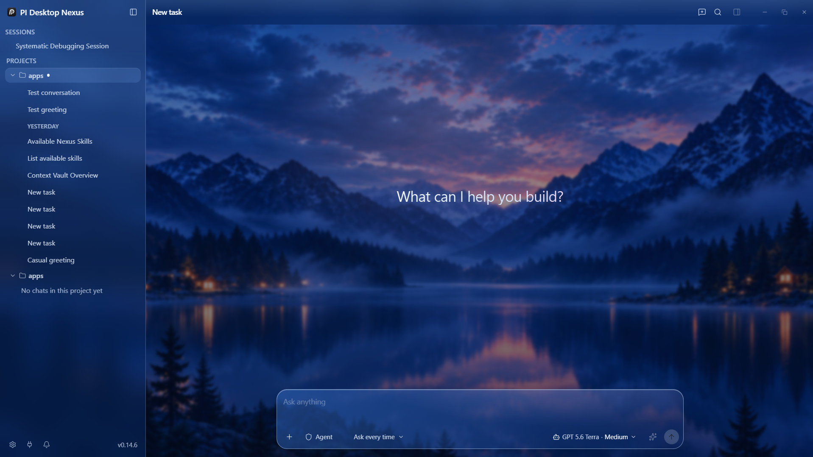
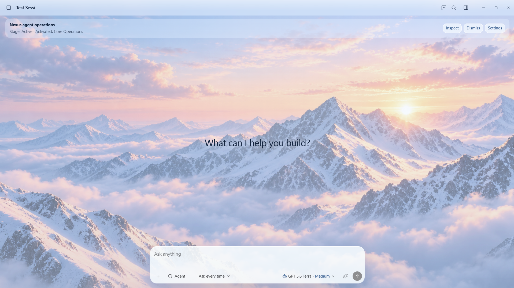
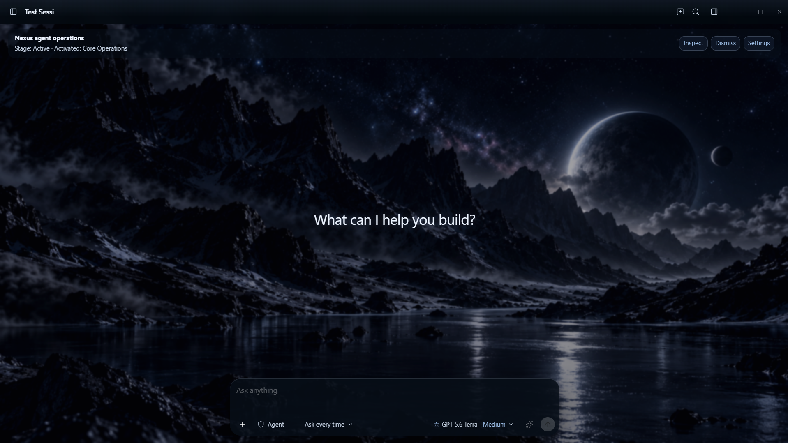
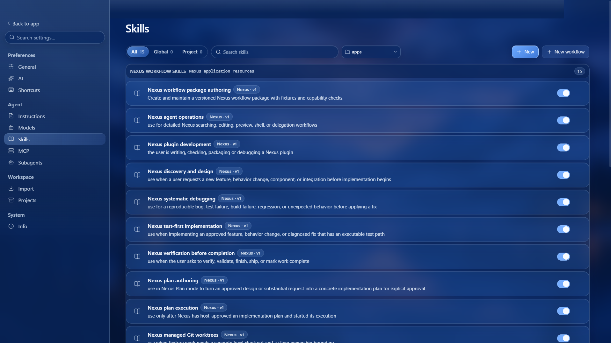

<div align="center">


# Nexus

### A workflow-native, local-first AI coding workspace.

Nexus is an independent PI Desktop fork. It keeps the desktop foundation for
local projects, providers, permissions, plugins, MCP, and subagents, then adds
integrated workflows that make capable AI coding work easier to steer, inspect,
and repeat.

<br />

[](https://github.com/vastsa/PI-Desktop)
[](LICENSE)


**Nexus is a separate fork, not the real/upstream PI Desktop application.**

</div>

---

## Why Nexus?

PI Desktop provides a solid local desktop agent workspace. Nexus builds on it
with a first-class workflow system and a more deliberate engineering loop.

Instead of treating skills as passive Markdown instructions, Nexus treats them
as **versioned, capability-aware workflow packages**. A workflow can be matched
to a clear task, guide the current stage of work, show why it is active, and
remain bounded by the same tools and permissions Nexus already provides.

| Nexus addition | What it changes |
| --- | --- |
| **Integrated workflow packages** | Skills have manifests, versions, activation rules, capability contracts, fixtures, stages, and settings—not only an instruction body. |
| **Automatic workflow selection** | Nexus uses prompt intent, workspace facts, mode, and session state to activate compatible high-confidence workflows. Users can inspect, activate, or dismiss them. |
| **Quality workflow library** | Discovery, debugging, test-first implementation, verification, planning, Git/review, parallel-task, and workflow-authoring guidance is rewritten for Nexus. |
| **Plan lifecycle** | Discovery, approved plan, execution, verification, and safe resume connect directly to Nexus Plan mode. |
| **Managed engineering workflows** | Git worktree, review, completion, subagent, and parallel-task workflows preserve isolation and follow a no-push-by-default policy. |
| **Context Vault** | A host-owned workspace context surface keeps durable, inspectable project knowledge available to the agent. |
| **Twilight Mountains** | An optional first-party blue-glass scenic theme with a bundled local backdrop and readable safety surfaces. |

Nexus is model-agnostic and guidance-first. Workflows never grant tools,
bypass confirmations, weaken plugin isolation, or alter the upstream PI Desktop
checkout.

---

## Twilight Mountains

Twilight Mountains is an optional built-in theme, never the default. It keeps a
dark base for native controls and plugin compatibility while adding a local
mountain backdrop, layered blue-glass materials, readable controls, and
high-opacity surfaces for code, tool output, menus, dialogs, and permissions.

<p align="center">
  
</p>

This is a complete visual system rather than wallpaper behind an app: Chat,
Settings, Plugins, the composer, work panels, menus, dialogs, and safety UI
all receive related materials. Reduced-transparency and unsupported-filter
paths retain the same readable hierarchy without blur.

---

## Alpine Light

Alpine Light is a first-party light scenic workspace with an icy mountain
backdrop, pale glass surfaces, and the same readable composer and workflow
treatment as the rest of Nexus.

<p align="center">
  
</p>

---

## Obsidian Horizon

Obsidian Horizon is a first-party dark scenic workspace with a moonlit mountain
backdrop, charcoal glass materials, and high-contrast surfaces for long coding
sessions.

<p align="center">
  
</p>

---

## Workflow-native skills

Nexus bundles workflows for the tasks coding agents face most often. The active
workflow, current stage, and activation reason remain visible in the app, while
session-level overrides remain under the user's control.

<p align="center">
  
</p>

The built-in workflow library covers:

- discovery and design before implementation;
- systematic debugging of reproducible failures;
- test-first implementation and verification before completion;
- writing and executing approved plans;
- isolated Git worktrees, code review, and branch completion;
- bounded parallel tasks and subagent coordination;
- authoring, validating, versioning, and previewing Nexus-native workflows.

Workflows guide quality and sequence. They do not force a model provider,
depend on OpenAI-only computer use, or turn an instruction file into extra
authority.

---

## Built for controlled local AI work

Nexus preserves the practical PI Desktop foundation:

- local projects, sessions, imports, files, shell work, and agent tools;
- cloud, local, and OpenAI-compatible model providers;
- permission-aware edits and commands;
- MCP servers, plugins, skills, and specialized subagents;
- Plan mode for explicit implementation approval;
- desktop support for macOS, Windows, and Linux.

The goal is simple: make strong AI coding workflows safer to steer and easier
to understand without taking control away from the person using the app.

---

## Development

```bash
git clone https://github.com/alphalaughs2024-netizen/PI-Desktop-fork.git
cd PI-Desktop-fork
pnpm install
pnpm dev
```

For PowerShell development with an isolated Nexus data directory:

```powershell
Set-Location "C:\path\to\PI-Desktop-fork"
$env:PI_DESKTOP_DATA_DIR = "$env:USERPROFILE\.pi-desktop-nexus-dev"
pnpm dev
```

The separate data directory keeps a development Nexus instance isolated from
the real PI Desktop application's local data.

## Documentation

- [Theme Authoring Playbook](docs/THEME_AUTHORING_PLAYBOOK.md)
- [Specification index](docs/spec/README.md)
- [Architecture](docs/spec/02-architecture/01-architecture.md)
- [Plugin development](docs/plugin-development.md)
- [Repository development rules](AGENTS.md)

## Upstream and license

Nexus is built on the open-source PI Desktop project. Credit for the original
desktop workspace and its ecosystem belongs to the upstream project and its
contributors.

This fork is licensed under the [GNU Lesser General Public License v3.0](LICENSE).
